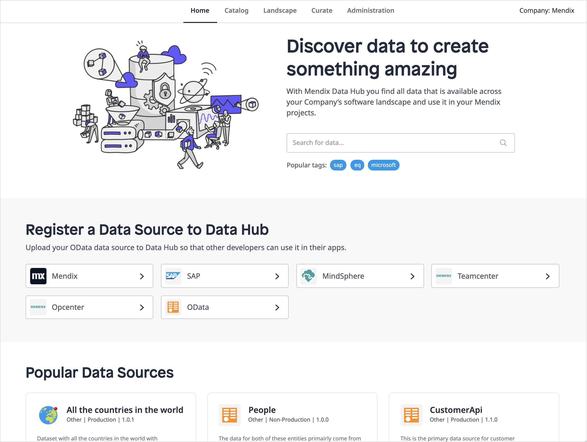
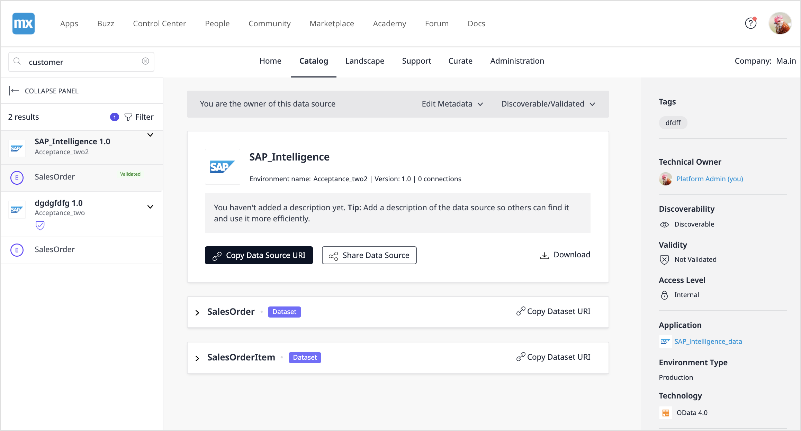
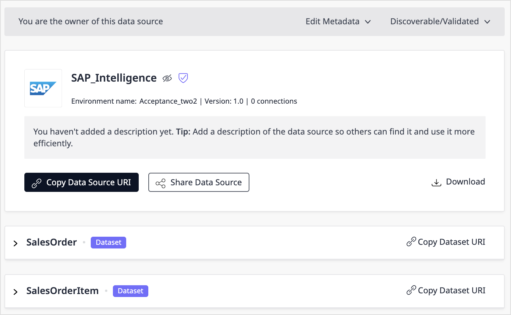
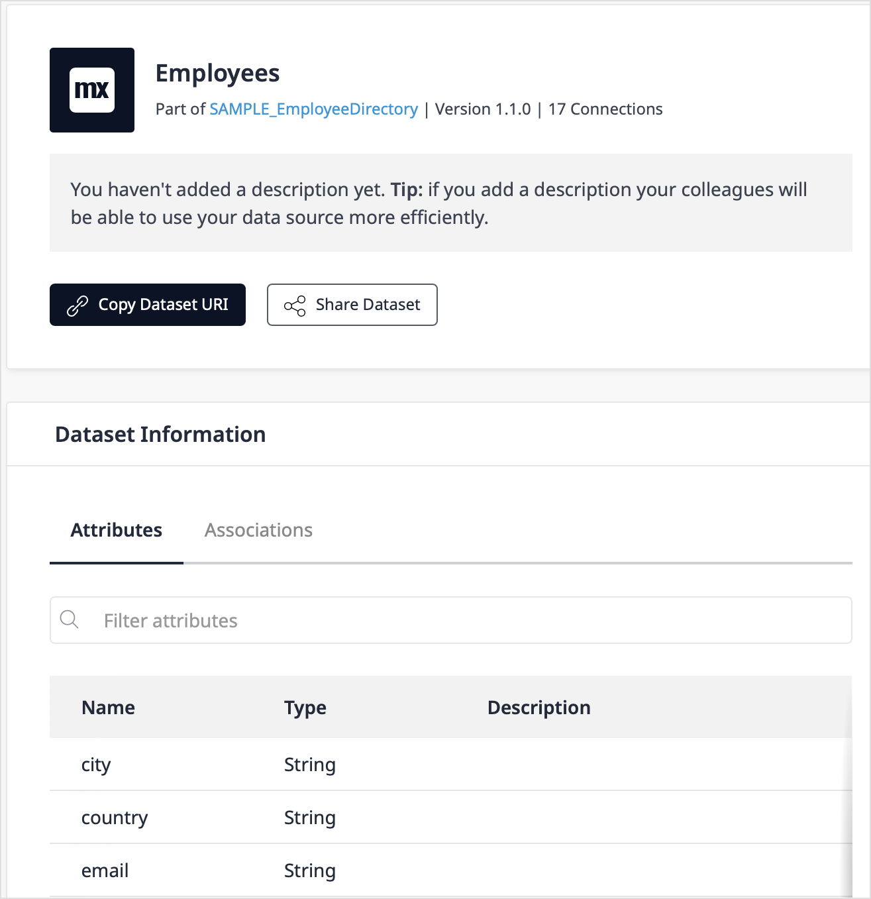
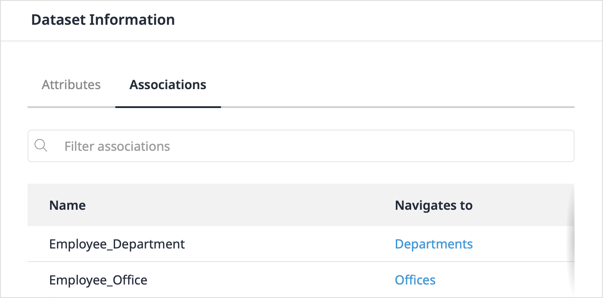
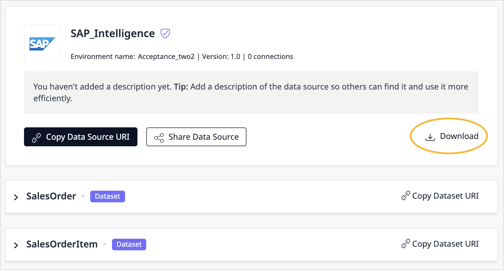

## 1 Introduction

Finding the right data is made easier with the Data Hub Catalog search functionality. The details of data assets are displayed in the [asset details](#search-details) screen. 

The [Copy Data Source URI](#service-details) or **Download** contract buttons enable you to integrate registered data sources into your enterprise applications.

You can start searching from the [Data Hub](#data-hub-home) page or click the [Catalog](#search-tab) tab to go to the **Search** pane and **Asset Details** screen.

The [Data Hub pane](/refguide/data-hub-pane) in Studio Pro connects to the powerful search in the Data Hub Catalog to enable you to use registered datasets as external entities in you app development.

This page describes the search functionality of the Data Hub Catalog and the information that is displayed for registered assets.

## 2 Details of Registered Assets

The [details](#search-details) screen for a registered data source, dataset, or attribute displays information as provided in the published OData service contract that is used to register assets in the Data Hub Catalog. Registered services and the exposed datasets can be curated to provide additional information such as **Tags** and **Descriptions** to ensure that they can be found by the appropriate users.

{}The **Dataset** is the name of the **Entity set** of a published **Entity** in Mendix Studio Pro, which by default, is the entity name with an "s" appended to it. For example, if an entity named `Customer` is published in an OData service, the **Dataset** name in the **Search Details** will be `Customers`.{}

### 2.2 Versions 

Every published OData service or data source (as they are known as in the Catalog) has a version number, and apps that consume a datasource will consume from a specific version. Updates and changes to a service will be indicated by a change in the version number if good practice is followed by the data source originators. This means that there may be several versions of a registered data source available in the catalog and they will all be listed as separate items in the search results for the same-named data source.

The [search details](#search-details) screen in the Data Hub Catalog displayed the version of the selected service.

### 2.3 Environments

The Data Hub Catalog is a register of apps that are deployed to a particular environment and the services or data sources published from the apps are deployed to the same environment. This means that the Catalog registers the version of a service running in a specific environment. 

The environment also provides an indication of the quality of the dataset that is available. Shared datasets that are available from a *production environment* will have production-level data, while those in non-production environments (*acceptance*, *development*) could be populated with data that may not be reliable for building stable apps but be useful for development work.

The search results will show these data source endpoints (which is the combination of the location of the OData service version deployed on a specific environment). Therefore, if a version of a service is deployed on both a test and acceptance environment, a search on the service name in the Data Hub Catalog will have two hits of the two endpoints. 

The environment is therefore a major component of the definition and forms part of the URL for the endpoint being consumed. This, in combination with the OData version number, provides the link to the correct data for the datasets that are exposed.

{}
By default, search results in the Data Hub Catalog are filtered to show only hits in the Production environment. You can extend the search to **Non-production** or **Mendix Free App (Sandbox)** environments by checking them in the search pane **Add Filter** list. For more details, see [Filters](#filter).
{}

### 2.6 Tags 
Tags help you to group services and datasets and categorize them (for example, by department, process, or use). You can use tags to refine the search and filter search results in the Data Hub Catalog by doing the following:

* Add tags to the service as a curate function in the Data Hub Catalog after a service is registered by service owners and [Data Hub Curators](/data-hub/#curator)
* Add different tags to the different versions of the same service, as they will be two separately registered assets in the catalog (this is also a way to make different version identifiable)
* Add tags to the datasets exposed in the service
* Add tags in the [manual registration of OData v4 services](register#registration-form)

### 2.7 Description
The description that is included as part of the published service metadata. This description can be further curated at the data source, dataset, and attribute level by owners and curators to provide further details of the exposed datasets and the associated data.

{}
In Studio Pro, when publishing an OData service, it is possible to specify a summary of the service and a description. Only the description is included in the OData service contract document and displayed in the Data Hub Catalog.
{}

### 2.8 Owners for Registered Apps and Services 
In the Data Hub Catalog, the search details for a service include a **Technical Owner** (for technical inquiries) and the **Business Owner** who is responsible for the data sets. Owners who are registered Mendix platform users can curate their assets.

## 3 Searching in the Data Hub Catalog {#data-hub-home}

When searching in the Data Hub Catalog, the following fields are searched:

* Data source or service endpoint: Name, Description, Tags
* Application: Name
* Dataset: Name, Description
* Attribute: Name, Description
* Association: Name

From the **Data Hub** page, you can search in the Data Hub Catalog in the following ways:

* Type a search term in the search box and click **Search** (search strings can comprise a minimum of 3 characters and include the alphanumeric characters)
* Click one of the *tags* given in the **Search suggestions**
* Click one of the services under **Most Popular Services**
* Click the **Catalog** tab

Any of the above actions will take you to the **Search** screen, which is described below.

## 4 Search Screen {#search-tab}

The **Search** screen is divided into the [search](#search-pane) pane on the left, the [asset details](#search-details) of the selected asset in the centre panel, and the [asset metadata](#metadata) panel on the right.

### 4.1 Search Pane {#search-pane}

The collapsable **Search** pane is used to search for registered assets in the Data Hub Catalog:

 {}{}

#### 4.1.1 Search Area

Enter a search string in the **Search** area comprising a minimum of 3 alpha-numeric characters.

The wildcard `*` can also be used to imply an empty search but it is not necessary as search without specifying any search string will return all registered items. 

{}
Punctuation cannot be used as part of the search term. 
{}

{}
Search is case-insensitive.
{}

#### 4.1.2 Filters {#filter}

You can filter search results by environment type. By default, the **Production** environment filter is active to restrict search results to the production environment. The number of filters that are active for the current search is displayed adjacent to the filter: 

{}{}

To specify the environment type for the search, click **Filter**:

In the **Filters** dialog box, check the **Environment Type** that you want to restrict your search to and click, **Apply Filters**. The search results will only display hits for the specified search string in the checked environments.

Click **Clear Filters** to clear all the checked environments and click **Apply Filters** to see search results in all environments.

{}
The **Sandbox** filter refers to apps deployed to the Mendix Free App environment. 
{}

#### 4.1.3 Search Results

The number of items satisfying the search criteria (search string plus filters) are shown at the top of the search results. Search results will include assets that match the search string and satisfy the active filters. Items that are included in the search include all application names, data sources, datasets (or entity sets), attributes, tags, and descriptions. The order of the search results will be a combination of the following:

* Closest match to the search string
* Popularity of the service (number of connections)

If no search string is specified, all registered assets will be listed in the search results pane in order of popularity (number of connections to the asset).

When an item in the search results is selected, the **Catalog** tab will display the **Details** of the asset and the **Landscape** tab will show the network of connections and dependencies of the selected item in the [Data Hub Landscape](/data-hub/data-hub-landscape/).

### 4.2 Selected Asset Details {#search-details}

When you click on an asset (data source or dataset) in the search results, the details are displayed in this panel. 

#### 4.2.1 Details of a Selected Data Source {#service-details}

The contract of the published OData service (the *$metadata* document) contains the definitions details of what is exposed in the service. This includes the metadata of the exposed datasets (or entity sets in Mendix Studio Pro) and their exposed attributes, associations, types, and accessibility. This information is displayed for the Data Source details. 

For details on creating a published OData service in Studio Pro, see [How to Register Data Assets](register).When a data source is selected in the search results, the following details are displayed:

* Application icon

* Name of the data source

* **Non-discoverable** icon – if the data source has been set to non-discoverable (by default, no icon indicates that it can be seen by all users)

* **Validated** icon – if it has been set for the asset

* **Environment Name** – where the app is deployed

* **Version** number of the service

* **Connections** –  number of apps that consume the service

* A description of the data source

* All **Datasets** that are exposed in the data source (you can expand each one to see details of the attributes and associations) 

	{}In Mendix Studio Pro, the **Dataset** is the name of the **Entity set** of a published **Entity**, which by default, is the entity name with an "s" appended to it. For example, if an entity named `Customer` is published in an OData service, the **Dataset** name in the **Search Details** will be `Customers`.{}
	

You can perform the following actions from this screen:

* **Copy Data Source URI** –  click to copy the URI of the data source contract to the clipboard. This URI can be used to integrate the data source in other enterprise applications.
*  **Share Data Source** –  click to copy the link to this asset detail page to the clipboard so that you can share it with others.
*  [Download](#download-contract) – retrieve and save the metadata contract locally.
* **Copy Dataset URI** – click to copy the URI of the dataset to the clipboard for use in other business applications.

#### 4.2.2 Details for a Selected Dataset {#entity-details}

When an **Dataset** is selected in the search results, the following details are displayed in the **Search Details** panel:

* Dataset name

* **Part of** –  a link to the data source details page that the dataset is exposed in

* **Version** number of the data source that the dataset is exposed in

* **Connections** – the number of apps that consume this dataset

* A description of the dataset

* **Dataset Information**
	The **Attributes** that are exposed for the dataset for this data source are listed showing the attribute types and description.

	Under the **Associations** tab for each dataset, the associations are shown:

	

	* **Name** – the name of the association that is exposed in the OData service contract
	* **Navigates to** – the dataset the association is made with. Click the link to see the details of the associated dataset in the Catalog. 
	* **Multiplicity** – the number of object at the other end of the association (0..1, 1 or *)

You can perform the following actions from this screen:

* **Copy Dataset URI** – click to copy the URI of the dataset to the clipboard for use in other business applications
* **Share Dataset** – click to copy the link to this dataset detail page to the clipboard so that it can be shared with others

### 4.3 Data Source Metadata Panel {#metadata}

The data source metadata panel at the right of the asset details screen displays details from the OData service metadata contract and values that have been curated in the Data Hub Catalog:

 {}{}

#### 4.3.1 Tags
Tags that have been assigned to the data source when it has been [curated.](curate#tags)
{}Tags assigned at a data source level propagate down to the datasets and attributes exposed in the service.{}

#### 4.3.2 Business Owner
A link to the business owner of the data exposed in the data source. Business owners can be changed as a curation task.
#### 4.3.3 Technical Owner
The technical contact of the app; by default this is the owner who registered the OData service. For apps hosted in the Mendix Cloud, the **Technical Owner** is the contact for technical issues about the app in the Mendix Cloud.

#### 4.3.4 Discoverability {#discoverability-metadata}
When a data source is registered, by default, it is made available to other users with the **Discoverable** setting active in the Data Hub Catalog. When this is set, all users can find it and the view details and consume it. Owners of a registered service and curators can set a data source as non-discoverable, which means it is not visible to users unless they are the owner or a curator.

The discoverability of the asset by users:

* **Discoverable** – all users of the Data Hub Catalog and Studio Pro can see and consume the asset provided they meet the requirements of the **Classification**
* **Non-Discoverable** – the asset is not visible in the Catalog and only owners, Data Hub curators, and the Data Hub Admin can find, use, and curate the service. See [Curate Bar](#curate-bar) for changing **Discoverability** as the owner of the data source or curator.
  {}A **Non-discoverable** asset is also not included in the search results in the **Data Hub** pane of Studio Pro, or any other client of the Data Hub API.{}
#### 4.3.5 Validated
Indicates if the data source has been **Validated**. See [Curate Bar](#curate-bar) for changing **Validated** as an owner of the data source or curator.
#### 4.3.6 Access Level
Shows the access classification of the service; end-users of the data associated with the datasets exposed in the service must have the appropriate [user role](/refguide/user-roles) to access the data:

* **Public** – classified as public and available to all users	
* **Internal** – restricted to the members of the organization
  {}Classifications at a data source level propagate down to the datasets and attributes exposed in the OData service. {}

#### 4.3.7 Application
A link to the application from which the data source was published in the given environment 
#### 4.3.8 Environment Type
Indicates the quality and the status of the data associated with the exposed datasets by the environment that the app and service are deployed to. The following are the environment types: 

* **Production**
* **Non-Production** 
* **Sandbox** (the Mendix Free App environment) 

### 4.4 Curate Bar {#curate-bar}

The **Curate Bar** is displayed on the asset detail screen if you are the owner of the selected asset or a curator:

You carry out the following actions:

* **Edit Metadata** – edit information that is displayed in the Catalog for the asset: 
  * for a selected data source you can edit [Application Details](./curate#curate-application) and [Data Source Details](./curate#service-details)
  *  for a selected dataset you can edit [Dataset Details](./curate#curate-datasets)
* **Discoverable**/**Validated** – set the discoverability of the service, and validate the dataset
  * **Discoverable** – all users of Data Hub and Studio Pro can see and consume the service in combination with the classification of the data
  * **Non-Discoverable** – the service is not visible and only owners of the service, Data Hub curators, and the Data Hub Admin can access the service
  * **Validated** – indicates if the dataset has been validated

{}By default, newly registered services are set to **Discoverable** and visible to all users. {}

For further details on curating registered assets see [Curation](./curate).

## 5 Data Source and Dataset URIs 

The service URIs is the location of the service contract of the data source. The endpoints of all exposed datasets (entity sets) are defined in the contract. At a data source and dataset level, you can copy the URI's from the Asset Details screen by clicking the **Copy Data Source URI** and **Copy Dataset URI** to your clipboard. These URI can be used for directly accessing the resource in other BI applications. 

## 6 Download the Metadata Contract of a Data Source {#download-contract}

For a selected data source you can click **Download** to download the OData service contract as a ***.zip*** file. This will include the all the files that make up the full metadata contract. The resulting ***.zip*** file will be named as follows:

`DataHub_<service_name>_<service_version>_<technology>.zip`

The string *technology* identifies the OData version (v3 or v4) in the file name.

For the following example: 

When you click **Download** the following file is downloaded: `DataHub_SAP_Intelligence_1.0_OData4.zip`

This zip file cotains the folder: `DataHub_SAP_Intelligence_1.0_OData4` which contains the all the metadata files that define the service.

## 6 Viewing Search Results in the Data Hub Landscape

When an item is selected in the search results pane, you can click the [Landscape](/data-hub/data-hub-landscape/) tab to see the network of connections and dependencies for the selected asset. This enables you to graphically see the context and relevance for a selected item and the data for the exposed datasets.
