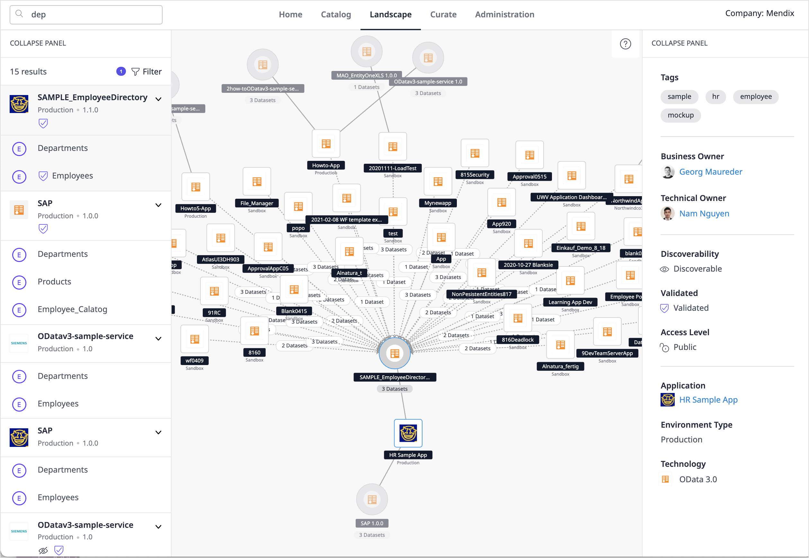
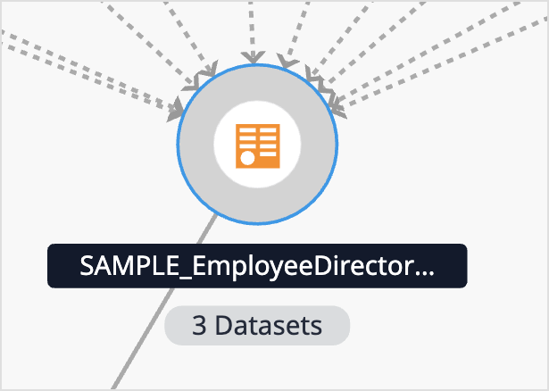

## 1 Introduction

The Data Hub Landscape presents a graphical view of the registered OData services in your Data Hub. It provides a landscape visualization of items registered in the [Data Hub Catalog](/data-hub/data-hub-catalog/) and their relationships with apps that consume the datasets that they connect to. In the Data Hub Landscape, the nodes are the runtime instances of applications (or, more specifically, the deployments of apps in specific environments) and the published OData services from the apps. All public services that are issued with Data Hub are also shown in the Landscape.

In the Landscape, you will see, at a glance, the network of deployments of the apps publishing OData services and those consuming them. It enhances searching for suitable data sources in the Data Hub Catalog by showing the following: 

* Popular apps in the Data Hub Landscape and the apps that consume data from them
* The dependencies between consuming and publishing apps
* All the services published from an app (deployed to a specific environment) and the datasets that are exposed in the service
* Details of the selected nodes
This visual display of registered assets will enable you to:
* Decide on the relevance of available assets by seeing the apps that they are consumed by
* Discover the context of the data being shared by the network of nodes for a service and the deploying app
* From the displayed network of dependencies, ascertain the differences between the services by seeing how the shared data is used

You can access the Data Hub Landscape from [Mendix Data Hub](https://hub.mendix.com/) by clicking the **Landscape** tab.

## 2 Data Hub Landscape in Detail

### 2.1 Structure and Flow of Data

A registered OData service includes the precise definition of the app and the datasets or entity sets—that provide the link to the shared data. The service endpoint and the deployment to a specific environment is shown as a node on the Landscape. 

The Landscape depiction of a service and its network will be such that it will show the "flow" of data from the bottom of the display towards the top according to the following principles:

*  An app publishing a service will be positioned below the service
* Services that are consumed by an app will always be shown below it
* Applications that consume a selected service will always be positioned above it

### 2.2 Navigating the Landscape

By default, the Data Hub **Search** pane is on the left of the Landscape screen. When a service is selected in the search results, it is displayed in the center with its network of connections. The selected service and the deploying app are highlighted with a blue outline.

When you click any of the nodes or connections, the metadata pane on the right displays further details.

You can pan around the landscape and and zoom using the mouse. You can also collapse both the search pane and the metadata pane so that the full screen area is available for viewing.

When you click the **Catalog** tab the **Details** screen of the item selected is displayed in the search pane.

### 2.3 Nodes
Registered apps and services are depicted in the Landscape as nodes from the definitions in the registered service metadata. The icons for each of these nodes identifies the the source application, for example, Mendix and Siemens.

#### 2.3.1 Data Sources
Data sources or the published OData services are depicted as a round node with the icon that indicates the **Technology** (OData) and the service name and version number on the line connecting it to the publishing app, the number of datasets exposed in the service.

{}The application icon that is shown for the data source and application in the asset details screen and the search results is not shown for the data source in Landscape. Here the service technology is indicated.{}

The following is an example of a selected service node exposing three datasets:

#### 2.3.2 Apps
Apps are displayed as square icons with the application icon and the environment that the app is deployed to is given below the app name. The example below shows a non-Mendix app (**TeamcenterMfg**), a Mendix app (**CompanyCarDemo**) which are deployed to the Mendix Free App environment, **Sandbox**. The third example shows another Mendix app (**HRSample_App**) deployed to the production environment which has a custom icon. For further information on adding a custom icon to your app see [Changing the Application Icon](../data-hub-catalog/curate#application-icon).

### 2.4 Dependencies
The relationships and dependencies between apps, published services, and consuming apps are represented by connecting lines that also display the datasets that are published by a service and consumed by consuming apps. These are illustrated and described in the following examples: 

* **Solid gray line** – This links an app and the services published from the app in the specified environment. In the example, the selected app **LEGO-Machinesafety Data** has 2 published services, which includes**Published_OData_MS 1.0.0**. 
* **Broken gray line with an arrow (consume line)** – This indicates that an app is consuming from the service it is linked to by the line. The direction of the dependency is indicated by the direction of the arrow: the consuming app makes a call to the OData service for data from the publishing app—the arrow points to the service (or data source) which is "pulling" the data. The service will "get" the data associated with the endpoint of the consumed dataset from the publishing app.

  The app **StudioExperienceMob6Aug** consumes one dataset through **Published_OData_MS 1.0.0**, which is published from **LEGO - Machine Safety Data** in the production environment.

The network of dependencies that is shown will position the selected asset at the center of the network. 

{}
In the case when an app publishing a service also consumes from the same service, the line for the publishing dependency will be superimposed onto the line for the consuming dependency. This will result in only a single dotted-gray line being displayed. 
{}

### 2.5 Node Details
Clicking a node will display details of the node in the **Metadata** pane. You can see further details for the node in the asset details screen by clicking the **Catalog** tab.

### 2.6 Consumed Datasets
If you click the **Entity** icon on the consume line, the names of the datasets that are being consumed from the service will be shown in the right panel.

