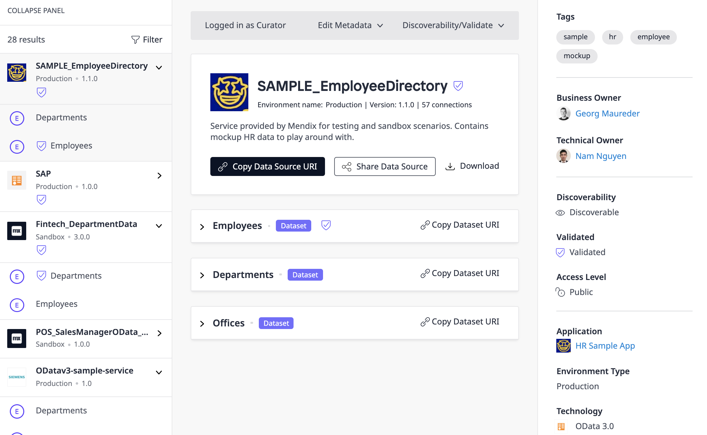
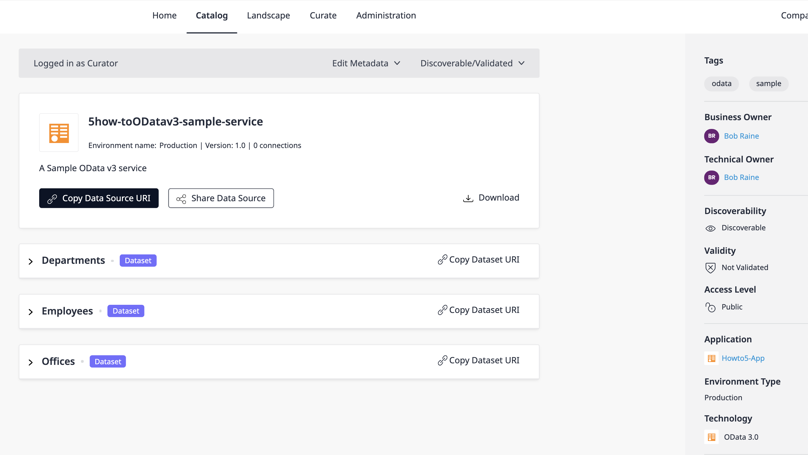
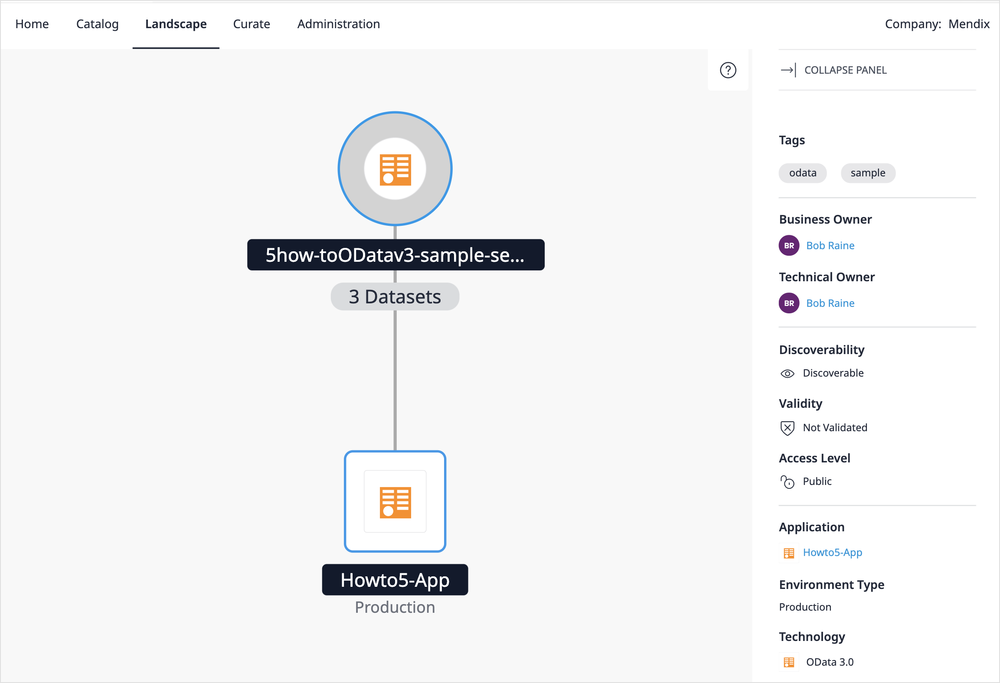

## 1 Introduction

This document provides examples of the calls that are described in the [Using the Data Hub API How-to](data-hub-api-how-to). The latest Data Hub APIs are provided at <https://datahub-spec.s3.eu-central-1.amazonaws.com/index.html>.

In some cases the example curl command is provided.

{}To use the Mendix Data Hub a license is required.{}

## 2 Base Variables used in this How-to

For convenience and conciseness, the following variables are used and should be substituted by the values given or those that are returned in your responses when you send the requests:

- {*AppUUID}* – insert the value the UUID of the application
- {EnvironmentUUID} – insert the value of the UUID of the environment
- <*your_PAT_Token*> – insert the value of your [PAT](/apidocs-mxsdk/apidocs/data-hub-apis#generatepat) as described in [Using the Data Hub API How-to](data-hub-api-how-to#pat)

## 3 Searching in the Catalog for the string: sample {#get-data-ex}

This example takes you through using the [Data Hub Search API](https://datahub-spec.s3.eu-central-1.amazonaws.com/search.html) to search in the Data Hub Catalog for the following:

- the search string `sample`
- in the production environments only (value `true`)
- for all registered contract types

### 3.1 Base Request URL

**The GET request URL is as follows**:

`GET https://hub.mendix.com/rest/search/v3/data?query=sample&productionEndpointsOnly=true`

**The example curl command for the above search is**:

```curl
curl -X 'GET' \
  'https://hub.mendix.com/rest/search/v3/data?query=sample&productionEndpointsOnly=true' \
--header 'Authorization: MxToken <your_PAT_Token>'
```
where <*your_PAT_Token*> is the value for your PAT token

### 3.2 Successful 200 Response

The 200 OK response returned that the `TotalResults` are that **11 assets** were found that satisfy the search string and parameters.

The response payload is shown below:

{}For conciseness in this how-to, of the 11 objects that are returned for the `Data` object only the second data source, **SAMPLE_EmployeeDirectory**, is shown fully in the response payload below, the other data sources have been represented as { … }.{}

```json
{
​    "TotalResults": 11,
​    "Links": [
​        {
​            "Href": "https://hub.mendix.com/rest/datahubservice/v2/data?query=sample&productionEndpointsOnly=true",
​            "Rel": "First"
​        },
​        {
​            "Href": "https://hub.mendix.com/rest/datahubservice/v2/data?query=sample&productionEndpointsOnly=true",
​            "Rel": "Current"
​        },
​        {
​            "Href": "https://hub.mendix.com/rest/datahubservice/v2/data?query=sample&afterId=c6afa18d-4b3d-49b2-a945-5a93b9a0868e&productionEndpointsOnly=true",
​            "Rel": "Next"
​        }
​    ],
​    "Data": [
​        {...   },
​        {
​            "Connections": 43,
​            "Validated": **true**,
​            "Description": "Service provided by Mendix for testing and sandbox scenarios. Contains mockup HR data to play around with.",
​            "SecurityClassification": "Internal",
​            "TotalItems": 3,
​            "Name": "SAMPLE_EmployeeDirectory",
​            "Version": "1.1.0",
​            "ContractType": "OData_3_0",
​            "Environment": {
​                "Type": "Production",
​                "UUID": "c2fee2c5-00da-4b8b-b3b3-71433b02f064",
​                "Name": "Production",
​                "Location": "https://hrsampleapp.mendixcloud.com"
​            },
​            "Links": [
​                {
​                    "Rel": "Self",
​                    "Href": "https://hub.mendix.com/rest/datahubservice/v2/applications/30aaf7ca-415f-306d-bd6e-458e6f821f06/environments/c2fee2c5-00da-4b8b-b3b3-71433b02f064/services/SAMPLE_EmployeeDirectory/1.1.0"
​                },
​                {
​                    "Rel": "Catalog",
​                    "Href": "https://hub.mendix.com/link/endpoint?EndpointUUID=d4369ff2-cb61-4db0-b77c-b0ba35b052e1"
​                }
​            ],
​            "Items": [],
​            "LastUpdated": "2021-03-09T13:47:04.482Z",
​            "UUID": "d4369ff2-cb61-4db0-b77c-b0ba35b052e1",
​            "SecurityScheme": {
​                "Types": [
​                    {
​                        "Name": "Anonymous"
​                    }
​                ],
​                "MxAllowedRoles": [
​                    {
​                        "ID": "8dd52bfa-6d7e-453b-b506-303c0a3d9567",
​                        "Name": "Administrator"
​                    },
​                    {
​                        "ID": "53f5d6fa-6da9-4a71-b011-454ec052cce8",
​                        "Name": "User"
​                    }
​                ]
​            },
​            "Application": {
​                "Type": "Mendix",
​                "TechnicalOwner": {
​                    "Email": "nam.nguyen@mendix.com",
​                    "OpenID": "https://mxid2.mendixcloud.com/mxid2/id?id=81b8f360-0e75-4195-b1b7-30aed6018eae",
​                    "Name": "Nam Nguyen"
​                },
​                "Icon": "https://hub.mendix.com/rest/documents/v1/images/944a6477-e83c-4236-a6b8-3374c6551657",
​                "UUID": "30aaf7ca-415f-306d-bd6e-458e6f821f06",
​                "RepositoryLocation": "https://sprintr.home.mendix.com/link/project/98c8f370-7bbe-4df5-8289-031c10383ece",
​                "BusinessOwner": {
​                    "Email": "georg.maureder@mendix.com",
​                    "OpenID": "https://mxid2.mendixcloud.com/mxid2/id?id=283b4e98-cee5-4181-88e9-3c87624944bb",
​                    "Name": "Georg Maureder"
​                },
​                "Name": "HR Sample App"
​            },
​            "Tags": [
​                {
​                    "Name": "sample"
​                },
​                {
​                    "Name": "hr"
​                },
​                {
​                    "Name": "employee"
​                },
​                {
​                    "Name": "mockup"
​                }
​            ]
​        },
​        { ... },
​        { ... },
​        { ... },
​        { ... },
​        { ... },
​        { ... },
​        { ... },
​        { ... },
​        { … }
​    ],
​    "Limit": 20,
​    "LastId": "c6afa18d-4b3d-49b2-a945-5a93b9a0868e"
}
```

### 3.3 Example Search Results Viewed in the Catalog

The same search in the Data Hub would look like the following screenshot showing the total list in the search results pane on the left and the details of the selected **SAMPLE_EmployeeDirectory** :



### 3.4 Retrieve full details of a Specific Endpoint???? - does PM want this illustrated???


## 4 Registering an OData Contract {#reg-contract-ex}

This example takes you through all the steps required to reigster an app, the environment that it is deployed to, and the data source that is published by the app in this environment.

This registration must done in the following order:

1. Application that the data source originates from: `POST application`
2. Environment that the data source is deployed to: `POST environment`
3. The published services from the application (data sources) : `PUT published-endpoints`

When the application and environment is already registered in the Catalog, then you can proceed to the [`PUT published-endpoints`](#reg-service-ex).

An example Odata v3 service – **DataHub_Sample_1.0.0_OData3** – is provided in [Sample Contract File](#sample-contract) (in the required escaped JSON format) that you can use when you are trying out the API calls.

{}OData service contract files must be included in the request body in escaped JSON format. There are several online converters available for converting your *.xml* files into this format such as one available from [Freeformatter.com](https://www.freeformatter.com/json-escape.html#ad-output). Just paste the contents of your files and convert them to the escaped format. {}

### 4.1 Registering the `Howto5-App` {#ex-reg-app}
In this example, you are going to register an app called **Howto5-App**. The details of the app are included in the JSON format request body given below.

#### 4.1.1 Base request URL

`POST {{baseURL}}/applications`

#### 4.1.2 JSON Format Request Body

Copy the contents of this body, or save it to a file, and include it as part of your API request.

```json
{
  "Name": "Howto5-App",
  "Description": "This application is used to show how the DH API is used",
  "RepositoryLocation": "https://dhcorp5.test/",
  "Type": "Other",
  "BusinessOwner": {
    "FirstName": "Bill",
    "LastName": "Raine",
    "Email": "bill.raine@dh123.co"
  },
  "TechnicalOwner": {
    "FirstName": "Bob",
    "LastName": "Raine",
    "Email": "bill.raine@dh123.co"
  }
}
```

#### 4.1.3 The example curl command

The full curl command would be:

```curl
curl --location --request POST '{{BaseURL}}' \
--header 'Content-Type: application/json' \
--header 'Authorization: MxToken <*yourMxToken>*' \--data-raw '{
  "Name": "Howto5-App",
  "Description": "This application is used to show how the DH API is used",
  "RepositoryLocation": "https://dhcorp5.test/",
  "Type": "Other",
  "BusinessOwner": {
​    "FirstName": "Bill",
​    "LastName": "Raine",
​    "Email": "bill.raine@dh123.co"
  },
  "TechnicalOwner": {
​    "FirstName": "Bob",
​    "LastName": "Raine",
​    "Email": "bill.raine@dh123.co"
  }
}
```

#### 4.1.3 Successful 201 Response Application Created {#app-registered}
The 201 response that is returned to indicate that the application is registered is given below:

{}The response returned the `"UUID": "2ab1410e-06d4-4e07-a82d-cc04b21d2622"`, which is the Catalog identifier for the application that must be used to identify it in subsequent steps of the registration of the data source. This value for the app UUID will be represented as {*AppUUID}* in the rest of this document. {}

```json
{
​    "Name": "Howto5-App",
​    "Description": "This application is used to show how the DH API is used",
​    "UUID": "2ab1410e-06d4-4e07-a82d-cc04b21d2622",
​    "RepositoryLocation": "https://dhcorp5.test/",
​    "Type": "Other",
​    "TechnicalOwner": {
​        "FirstName": "Bob",
​        "LastName": "Raine",
​        "Email": "bill.raine@dh123.co"
​    },
​    "BusinessOwner": {
​        "FirstName": "Bill",
​        "LastName": "Raine",
​        "Email": "bill.raine@dh123.co"
​    }
}
```

### 4.2 Registering the Environment `Production` for the Howto5-App {#reg-env-ex}

The following call is to register the environment **Production** for the **Howto5-App** that was reigstered in the previous section.

#### 4.2.1 Base request URL:

`POST {{baseURL}} /applications/{appUUID}/environments`

#### 4.2.2 JSON format request body for the Environment

The following request body must be included with the request.

```json
 {
    "Name": "Production",
    "Location": "https://howtoenv5555.test",
    "Type": "Production",
    "CustomLocations": [
        "https://api.howto5555.test"
    ]
}
```

#### 4.2.3 Successful 201 Created Successful 200 {#env-registerd}

The following 201 Created response returns the Catalog-generated identifier  `"UUID": "236c9acc-830c-48d9-a0ef-e1104a15d26d"` for the for the registered environment `Production`.

```json
{
​    "Name": "Production",
​    "Location": "https://howtoenv5555.test",
​    "Type": "Production",
​    "CustomLocations": [
​        "https://api.howto5555.test"
​    ],
​    "UUID": "68005eaa-f652-438f-b71c-f76f0d52e372",
​    "Application": {
​        "Name": "Howto5-App",
​        "Description": "This application is used to show how the DH API is used",
​        "RepositoryLocation": "https://dhcorp5.test",
​        "Type": "Other",
​        "UUID": "32112bd7-6c87-4ff8-9542-36256df66259"
​    }
}
```

### 4.3 Registering the Data Source 5how-toODatav3-sample-service {#reg-service-ex}

In this example call, the service **5how-toODatav3-sample-service** is registered for the application registered in [Section 4.1](#ex-reg-app) and deployed to the environment registered in [Section 4.2](#reg-env-ex).

Two tags, `odata` and `sample` are also included as part of the registration that will be added to the Catalog metadata that is shown for the asset and also used for searching for the asset.

For the `Contracts` object you can use the example OData v3 contract given in [Sample Contract](#sample-contract) for the key-value pair: `“Type”: “Metadata”`.

{}If you are using one of your own contracts then ensure that you include all the files that define the contract. {}

### 4.3.1 Base Request URL

`PUT` `{{baseURL}}/applications/{appUUID}/environments/{envUUID}/published-endpoints`

#### 4.3.2 JSON format request body for the `Endpoints` **Object**

The file tthat is used in this example is provided in escaped JSON format in [Sample Contract](#sample-contract).

{}For conciseness the contents of the contract file is not included in the following payload – it is represented as *<Insert example metadata from [metadata](#sample-contract) >*. You must insert the example contract file provided in [Sample Contract](#sample-contract) , or alternatively use your own contract files – in escaped JSON format. {}

```json
{
    "Endpoints": [
        {
            "Path": "/5howto/v1",
            "SecurityClassification": "Public",
            "Discoverable": true,
            "Validated": false,
            "ServiceVersion": {
                "Version": "1.0",
                "Description": "A Sample OData v3 service",
                "Service": {
                    "Name": "5how-toODatav3-sample-service",
                    "ContractType": "OData_3_0"
                },
                "Tags": [
                    {
                        "Name": "odata"
                    },
                    {
                        "Name": "sample"
                    }
                ],
                "SecurityScheme": {
                    "SecurityTypes": [
                        {
                            "Name": "MxID",
                            "AppStoreModuleId": "a4f7847b-9562-4b5a-adc2-4a0bf41cc534"
                        }
                    ],
                    "MxAllowedRoles": [
                        {
                            "Name": "User",
                            "UUID": "91ca220e-9498-4d23-9d2e-90b9c19aca37"
                        }
                    ]
                },
                "Contracts": [
                    {
                        "Type": "Metadata",
                        "Value": "<Insert example metadata from [metadata](#sample-contract) >
                    }
                ]
            }
        }
    ]
}
```

#### 4.3.3 Successful 200 OK Response

For the above request the following 200 OK response is received returning the registration details of the service. This includes the link to the URI of the service contracts, the URL to the catalog details page of the service and the service UUID. The Catalog entry for the service is also shown in [4.3.4](#ex-service-reg).

```json
{
​    "Endpoints": [
​        {
​            "Path": "5howto/v1",
​            "SecurityClassification": "Public",
​            "UUID": "ce825833-87b7-4f0f-8d8f-0fcfd40ccc57",
​            "Links": [
​                {
​                    "Href": "https://hub.mendix.com/rest/datahubservice/v2/applications/32112bd7-6c87-4ff8-9542-36256df66259/environments/68005eaa-f652-438f-b71c-f76f0d52e372/services/5how-toODatav3-sample-service/1.0",
​                    "Rel": "Self"
​                },
​                {
​                    "Href": "https://hub.mendix.com/link/endpoint?EndpointUUID=ce825833-87b7-4f0f-8d8f-0fcfd40ccc57",
​                    "Rel": "Catalog"
​                }
​            ],
​            "Connections": 0,
​            "LastUpdated": "2021-03-22T13:19:53.306Z",
​            "ServiceVersion": {
​                "Version": "1.0",
​                "Description": "A Sample OData v3 service",
​                "PublishDate": "2021-03-22T12:59:59.359Z",
​                "UUID": "9b813ec8-2725-446a-a189-b5337f5b9c9d",
​                "Service": {
​                    "Name": "5how-toODatav3-sample-service",
​                    "ContractType": "OData_3_0",
​                    "UUID": "3fba1292-0db2-4d68-9865-d5f30f5daa9e"
​                },
​                "SecurityScheme": {
​                    "SecurityTypes": [
​                        {
​                            "Name": "MxID",
​                            "AppStoreModuleId": "a4f7847b-9562-4b5a-adc2-4a0bf41cc534"
​                        }
​                    ],
​                    "MxAllowedRoles": [
​                        {
​                            "UUID": "91ca220e-9498-4d23-9d2e-90b9c19aca37",
​                            "Name": "User"
​                        }
​                    ]
​                },
​                "Tags": [
​                    {
​                        "Name": "odata"
​                    },
​                    {
​                        "Name": "sample"
​                    }
​                ]
​            },
​            "Validated": **false**,
​            "Discoverable": **true**
​        }
​    ]
}
```

#### 4.3.4 Registered Service in the Data Hub Catalog and Landscape {#ex-service-reg}

The resulting entry in the Catalog for the registered service the entry in the Catalog is the following:



This is shown in the Landscape as:



## 5 Registering Consumed Endpoints by the Howto5-App {#consumed-ep-ex}

This example provides the request to register that the **Howto5-App** consumes 2 datasets: **Employees** and **Offices** from the service **SAMPLE_EmployeeDirectory**.

{}For this example, the `Namespace` object for the `consumedItems` is called `DefaultNamespace` which is the default namespace for Mendix services.{}

### 5.1 Base Request URL

`{{baseUrl}}/applications/{AppUUID}/environments/{EnvironmentUUID}/consumed-endpoints`

### 5.2. JSON Format Request Body to Register Consuming from SampleDH-App

To register the two consumed entities **Employees** and **Offices** from the HR Sample service at https://hrsampleapp.mendixcloud.com/odata/PubOdataEmployeeDirectory/v1 the following body must be included as part of the request.

```json
{
    "Endpoints": [
        {
            "EndpointLocation": "https://hrsampleapp.mendixcloud.com/odata/PubOdataEmployeeDirectory/v1",
            "ConsumedItems": [
                {
                    "Type": "EntitySet",
                    "Name": "Employees",
                    "Namespace": "DefaultNamespace"
                },
                {
                    "Type": "EntitySet",
                    "Name": "Offices",
                    "Namespace": "DefaultNamespace"
                }
            ]
        }
    ]
}
```

### 5.3 Successful 200 Created Response

The successful 200 response that is returned shows the full details of the consumed service as part of the `Endpoints` object. The total number of connections to the service is **43**:

```json
{
​    "Endpoints": [
​        {
​            "Path": "odata/PubOdataEmployeeDirectory/v1",
​            "SecurityClassification": "Internal",
​            "UUID": "d4369ff2-cb61-4db0-b77c-b0ba35b052e1",
​            "Links": [
​                {
​                    "Href": "https://hub.mendix.com/rest/datahubservice/v2/applications/30aaf7ca-415f-306d-bd6e-458e6f821f06/environments/c2fee2c5-00da-4b8b-b3b3-71433b02f064/services/SAMPLE_EmployeeDirectory/1.1.0",
​                    "Rel": "Self"
​                },
​                {
​                    "Href": "https://hub.mendix.com/link/endpoint?EndpointUUID=d4369ff2-cb61-4db0-b77c-b0ba35b052e1",
​                    "Rel": "Catalog"
​                }
​            ],
​            "ConsumedItems": [
​                {
​                    "Name": "Employees",
​                    "Namespace": "DefaultNamespace",
​                    "Type": "EntitySet"
​                },
​                {
​                    "Name": "Offices",
​                    "Namespace": "DefaultNamespace",
​                    "Type": "EntitySet"
​                }
​            ],
​            "Environment": {
​                "Name": "Production",
​                "UUID": "c2fee2c5-00da-4b8b-b3b3-71433b02f064",
​                "Location": "https://hrsampleapp.mendixcloud.com",
​                "Type": "Production",
​                "Application": {
​                    "Name": "HR Sample App",
​                    "UUID": "30aaf7ca-415f-306d-bd6e-458e6f821f06",
​                    "RepositoryLocation": "https://sprintr.home.mendix.com/link/project/98c8f370-7bbe-4df5-8289-031c10383ece",
​                    "Type": "Mendix",
​                    "Icon": "https://hub.mendix.com/rest/documents/v1/images/944a6477-e83c-4236-a6b8-3374c6551657",
​                    "TechnicalOwner": {
​                        "Email": "nam.nguyen@mendix.com",
​                        "DisplayName": "Nam Nguyen",
​                        "OpenID": "https://mxid2.mendixcloud.com/mxid2/id?id=81b8f360-0e75-4195-b1b7-30aed6018eae"
​                    },
​                    "BusinessOwner": {
​                        "Email": "georg.maureder@mendix.com",
​                        "DisplayName": "Georg Maureder",
​                        "OpenID": "https://mxid2.mendixcloud.com/mxid2/id?id=283b4e98-cee5-4181-88e9-3c87624944bb"
​                    }
​                }
​            },
​            "Connections": 43,
​            "LastUpdated": "2021-03-09T13:47:04.482Z",
​            "ServiceVersion": {
​                "Version": "1.1.0",
​                "PublishDate": "2020-06-11T15:17:46.129Z",
​                "UUID": "bff79cf3-4652-44f6-9da2-3d96e1684cfd",
​                "Service": {
​                    "Name": "SAMPLE_EmployeeDirectory",
​                    "ContractType": "OData_3_0",
​                    "UUID": "64114e44-7b75-47a5-a727-8e4ddb3b2614"
​                },
​                "SecurityScheme": {
​                    "SecurityTypes": [
​                        {
​                            "Name": "Anonymous"
​                        }
​                    ],
​                    "MxAllowedRoles": [
​                        {
​                            "UUID": "8dd52bfa-6d7e-453b-b506-303c0a3d9567",
​                            "Name": "Administrator"
​                        },
​                        {
​                            "UUID": "53f5d6fa-6da9-4a71-b011-454ec052cce8",
​                            "Name": "User"
​                        }
​                    ]
​                },
​                "Tags": [
​                    {
​                        "Name": "sample"
​                    },
​                    {
​                        "Name": "hr"
​                    },
​                    {
​                        "Name": "employee"
​                    },
​                    {
​                        "Name": "mockup"
​                    }
​                ]
​            },
​            "Validated": **true**,
​            "Discoverable": **true**
​        }
​    ]
}
```

### 5.4 Registered service in the Catalog and Data Hub Landscape

This registration is shown in the Data Hub Landscape for the **SampleDHApp.** It consumes **2 datasets** from the **SAMPLE_EmployeeDirectory** service which is deployed from the **HR Sample App.**


When the **SAMPLE_EmployeeDirectory** is viewed in the Data Hub Landscape, **Howto5-App** is one of the network of apps consuming it:


## 6 Sample Contract File {#sample-contract}

The following file is an example OData v3 contract that you can use in this how-to for the PUT registration service request. The format provided below is in escaped JSON format contract and you can copy it and directly insert it in the PUT request body.

```json
<?xml version=\"1.0\" encoding=\"utf-8\"?>\r\n<edmx:Edmx Version=\"1.0\" xmlns:edmx=\"http:\/\/schemas.microsoft.com\/ado\/2007\/06\/edmx\" xmlns:mx=\"http:\/\/www.mendix.com\/Protocols\/MendixData\">\r\n  <edmx:DataServices m:DataServiceVersion=\"3.0\" m:MaxDataServiceVersion=\"3.0\" xmlns:m=\"http:\/\/schemas.microsoft.com\/ado\/2007\/08\/dataservices\/metadata\">\r\n    <Schema Namespace=\"DefaultNamespace\" xmlns=\"http:\/\/schemas.microsoft.com\/ado\/2009\/11\/edm\">\r\n      <EntityType Name=\"Department\">\r\n        <Key>\r\n          <PropertyRef Name=\"ID\" \/>\r\n        <\/Key>\r\n        <Property Name=\"ID\" Type=\"Edm.Int64\" Nullable=\"false\" mx:isAttribute=\"false\" \/>\r\n        <Property Name=\"Number\" Type=\"Edm.Int64\" \/>\r\n        <Property Name=\"Name\" Type=\"Edm.String\" \/>\r\n        <Property Name=\"Color\" Type=\"Edm.String\" \/>\r\n        <NavigationProperty Name=\"Employees\" Relationship=\"DefaultNamespace.Employee_Department\" FromRole=\"Department\" ToRole=\"Employees\" \/>\r\n      <\/EntityType>\r\n      <EntityType Name=\"Employee\">\r\n        <Key>\r\n          <PropertyRef Name=\"ID\" \/>\r\n        <\/Key>\r\n        <Property Name=\"ID\" Type=\"Edm.Int64\" Nullable=\"false\" mx:isAttribute=\"false\" \/>\r\n        <Property Name=\"firstName\" Type=\"Edm.String\" \/>\r\n        <Property Name=\"lastName\" Type=\"Edm.String\" \/>\r\n        <Property Name=\"email\" Type=\"Edm.String\" \/>\r\n        <Property Name=\"phone\" Type=\"Edm.String\" \/>\r\n        <Property Name=\"street\" Type=\"Edm.String\" \/>\r\n        <Property Name=\"city\" Type=\"Edm.String\" \/>\r\n        <Property Name=\"zip\" Type=\"Edm.String\" \/>\r\n        <Property Name=\"country\" Type=\"Edm.String\" \/>\r\n        <NavigationProperty Name=\"Department\" Relationship=\"DefaultNamespace.Employee_Department\" FromRole=\"Employees\" ToRole=\"Department\" \/>\r\n        <NavigationProperty Name=\"Office\" Relationship=\"DefaultNamespace.Employee_Office\" FromRole=\"Employees\" ToRole=\"Office\" \/>\r\n      <\/EntityType>\r\n      <EntityType Name=\"Office\">\r\n        <Key>\r\n          <PropertyRef Name=\"ID\" \/>\r\n        <\/Key>\r\n        <Property Name=\"ID\" Type=\"Edm.Int64\" Nullable=\"false\" mx:isAttribute=\"false\" \/>\r\n        <Property Name=\"Number\" Type=\"Edm.Int64\" \/>\r\n        <Property Name=\"Name\" Type=\"Edm.String\" \/>\r\n        <Property Name=\"Street\" Type=\"Edm.String\" \/>\r\n        <Property Name=\"StreetNumber\" Type=\"Edm.String\" \/>\r\n        <Property Name=\"ZIP\" Type=\"Edm.String\" \/>\r\n        <Property Name=\"City\" Type=\"Edm.String\" \/>\r\n        <Property Name=\"Country\" Type=\"Edm.String\" \/>\r\n        <Property Name=\"CountryCode\" Type=\"Edm.String\" \/>\r\n        <NavigationProperty Name=\"Employees\" Relationship=\"DefaultNamespace.Employee_Office\" FromRole=\"Office\" ToRole=\"Employees\" \/>\r\n      <\/EntityType>\r\n      <Association Name=\"Employee_Department\">\r\n        <End Type=\"DefaultNamespace.Employee\" Multiplicity=\"*\" Role=\"Employees\" \/>\r\n        <End Type=\"DefaultNamespace.Department\" Multiplicity=\"0..1\" Role=\"Department\" \/>\r\n      <\/Association>\r\n      <Association Name=\"Employee_Office\">\r\n        <End Type=\"DefaultNamespace.Employee\" Multiplicity=\"*\" Role=\"Employees\" \/>\r\n        <End Type=\"DefaultNamespace.Office\" Multiplicity=\"0..1\" Role=\"Office\" \/>\r\n      <\/Association>\r\n      <EntityContainer Name=\"SAP\/v1Entities\" m:IsDefaultEntityContainer=\"true\">\r\n        <EntitySet Name=\"Departments\" EntityType=\"DefaultNamespace.Department\" \/>\r\n        <EntitySet Name=\"Employees\" EntityType=\"DefaultNamespace.Employee\" \/>\r\n        <EntitySet Name=\"Offices\" EntityType=\"DefaultNamespace.Office\" \/>\r\n        <AssociationSet Name=\"Employee_Department\" Association=\"DefaultNamespace.Employee_Department\">\r\n          <End Role=\"Employees\" EntitySet=\"Employees\" \/>\r\n          <End Role=\"Department\" EntitySet=\"Departments\" \/>\r\n        <\/AssociationSet>\r\n        <AssociationSet Name=\"Employee_Office\" Association=\"DefaultNamespace.Employee_Office\">\r\n          <End Role=\"Employees\" EntitySet=\"Employees\" \/>\r\n          <End Role=\"Office\" EntitySet=\"Offices\" \/>\r\n        <\/AssociationSet>\r\n      <\/EntityContainer>\r\n    <\/Schema>\r\n  <\/edmx:DataServices>\r\n<\/edmx:Edmx>
```

