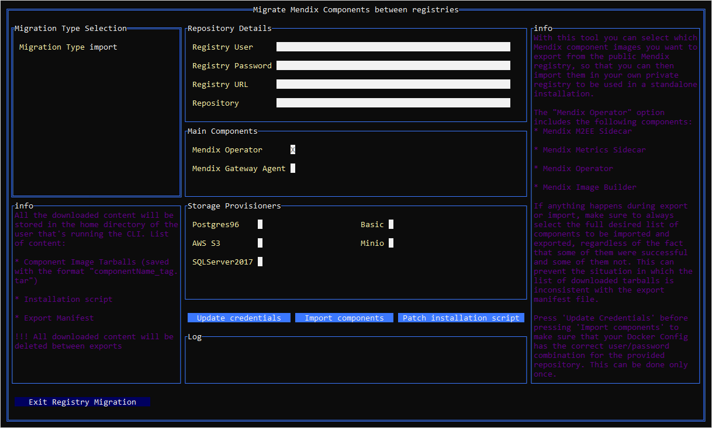

## 1 Introduction

When you have an OpenShift or Kubernetes cluster which is firewalled, you will need to host Mendix components in your own custom registry.

Storing images in your custom registry can also help as it caches images locally and saves network bandwidth.

This document explains how to export the components from the Mendix registry and import them into your own registry. It also explains how to tell the Mendix Configuration Tool to use your own registry when configuring the namespace.

## 2 Prerequisites for Migrating to Your Registry

To export components from the Mendix registry, you will need access to the internet.
You will also need all the other prerequisites for creating a Mendix for Private Cloud cluster, as documented in the [Prerequisites for Creating a Cluster](private-cloud-cluster#prerequisites) section of *Creating a Private Cloud Cluster*.

## 3 Download the Mendix Configuration Tool

Follow the instructions in [Creating a Private Cloud Cluster](private-cloud-cluster) using the configuration tool until you reach [Running the Configuration Tool](private-cloud-cluster#running-the-tool).

## 4 Export Mendix Components{#export}

To export the Mendix components you want to migrate to your own registry, you need to run the Mendix Configuration Tool in registry migration mode.

Follow these steps to export the Mendix components and store them on your local machine:

1. Start the Configuration Tool using the command `mxpc-cli registry-migration` to initiate registry migration mode.

2. Select **Migration Type** to be *Export*.

3. Select the **Main Components** and **Storage Provisioners** you want to export.

4. Enter the version numbers of any Mendix Runtimes which you want to export. You can use wildcards and create a list of versions separated by commas. For example `8.12.*, 7.23.6.*` will export all patch versions of the Mendix 8.12 runtime and the published build of the Mendix 7.23.6 runtime.

    

5. Click **Export components**.

    The components you selected will be extracted from the Mendix repository and saved on your local machine. This will be in the folder `C:\Users\<User id>\.mxpc-cli\registry-migration` on Windows or `home/<User id>/.mxpc-cli/registry-migration` for Mac and U*ix. This can take some time. Wait for the message *The images for the selected components were exported successfully in tarballs*.

## 5 Import Mendix Components Into Custom Registry

Once you have the Mendix components saved on your local machine, you can import them into your custom registry.

Perform the following steps.

1. If you are not continuing from the previous section, ensure that the Configuration Tool is started in registry migration mode. Use the command `mxpc-cli registry-migration` if it is not already running.

2. Select **Migration Type** to be *Import*.

3. Enter the following **Repository Details**:

    * Registry User – the username used for authorized access to the registry
    * Registry Password – the password used for authorizing the registry user
    * Registry URL
    * Repository – the name you have given to your repository

4. Click **Update Credentials**. 

5. Select the **Main Components** and **Storage Provisioners** you want to import into your own registry.

    {}You can only choose components which you exported in the previous section, [Export Mendix Components](#export).  
    **ALL** runtime versions you exported will be imported – you cannot choose which versions are imported{}

    

6. Click **Import components**.

    The components you selected will be uploaded from the folder on your local machine where they were saved, and imported into the selected registry. This will be from the folder `C:\Users\<User id>\.mxpc-cli\registry-migration` on Windows or `home/<User id>/.mxpc-cli/registry-migration` for Mac and U*ix.

## 6 Create and Configure Mendix for Private Cloud Cluster and Namespace

You can now create a new Mendix for Private Cloud cluster and namespace. To tell the Configuration Tool that you want to use your own registry, you will use the configuration tool with the argument `--registry {registry_url}/{repository}` (use the **Registry URL** value specified in the previous step as the `{registry_url}` value, and **Repository** as the value for `{repository}`).

{}
If you have already installed and configured a namespace, skip directly to the [Upgrade cluster](#upgrade-cluster) section.
{}

Continue following the instructions in [Creating a Private Cloud Cluster](private-cloud-cluster) from [Running the Configuration Tool](private-cloud-cluster#running-the-tool).

In the section [Running the Configuration Tool](private-cloud-cluster#running-the-tool), add the flag `--registry` to the command line that you paste into the terminal, before your press <kbd>Enter</kbd>.

### 6.1 Base Installation

With the `--registry` flag set, follow the instructions in the [Base Installation](private-cloud-cluster#base-installation) section of *Creating a Private Cloud Cluster*.

### 6.2 Configure Namespace

With the `--registry` flag set, follow the instructions in the [Configure Namespace](private-cloud-cluster#configure-namespace) section of *Creating a Private Cloud Cluster*.

When you get to the stage [Review and Apply](private-cloud-cluster#review-apply), the YAML file which you create will contain the location of your custom registry instead of the default Mendix registry. The patched YAML file is stored in the subfolder `.mxpc-cli/<project name/<folder name>/kube` of your user home directory (for example `C:\Users\<User id>\.mxpc-cli\<project name\<folder name>\kube` in Windows or `/home/<User id>/.mxpc-cli/<project name/<folder name>/kube` for Mac and U*ix). The **Installer output** panel will confirm the location of the saved file when you click **Write YAML**.

Click **Apply Configuration** to apply the configuration to your namespace, as normal.

### 6.3 Upgrade Cluster{#upgrade-cluster}

If you have already installed and configured a namespace, but would like to upgrade it to the current Mendix for Private Cloud version, 
follow the instructions in the [Upgrade cluster](private-cloud-upgrade-guide#upgrade-cluster) section of *Upgrading Private Cloud*.

To use images from your private registry, set the `--registry` flag when running the Mendix Configuration Tool.
