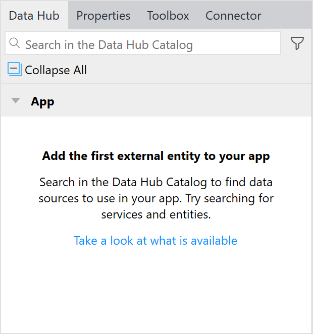
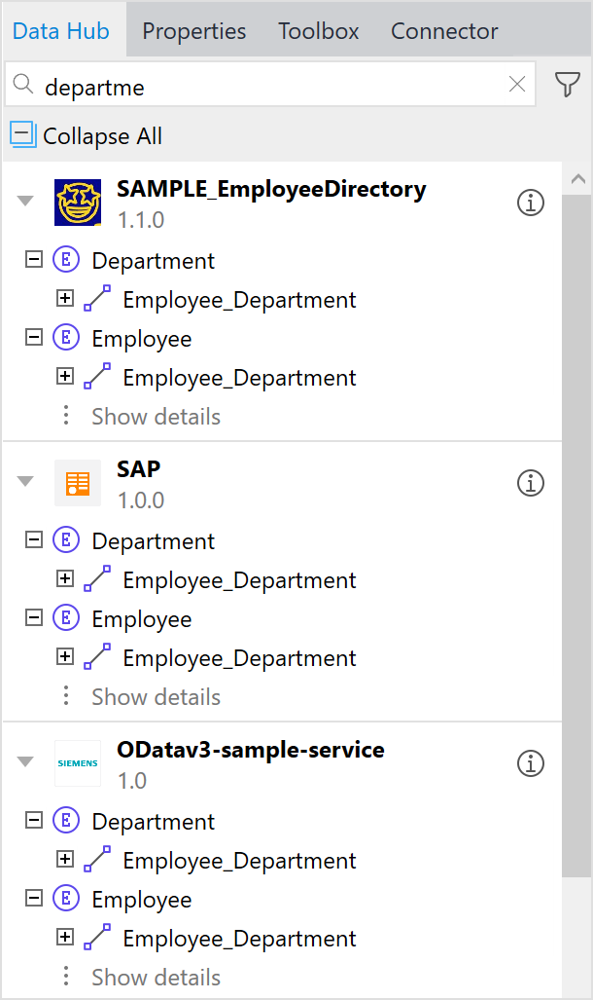
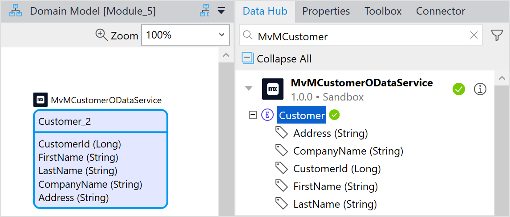
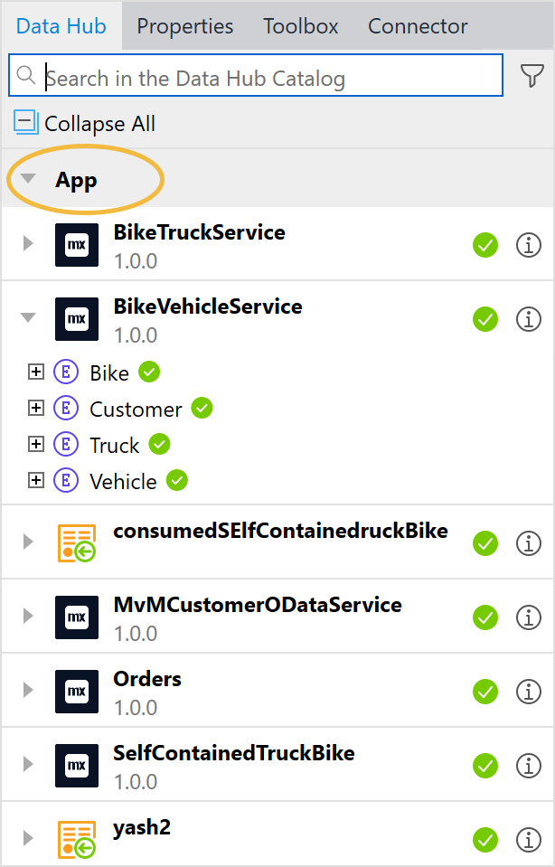
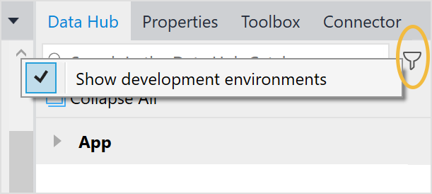
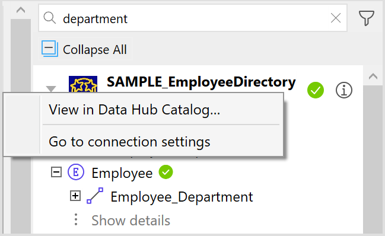
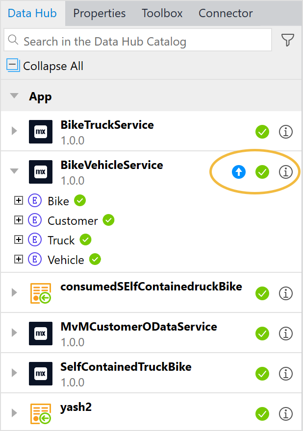
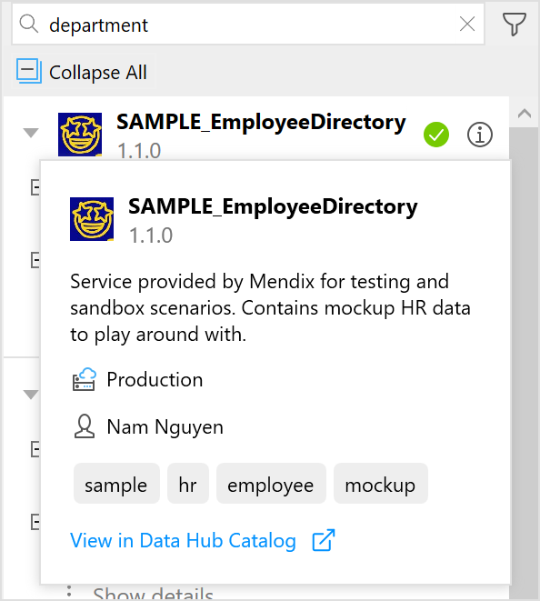
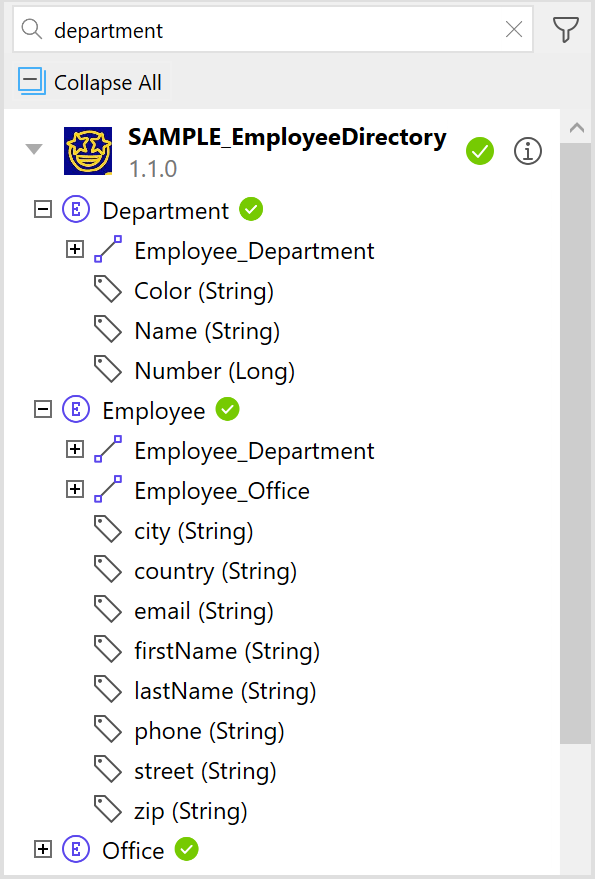
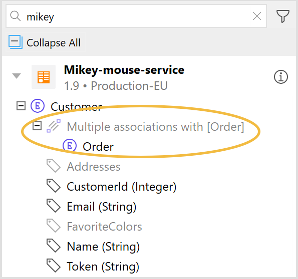

## 1 Introduction

[Mendix Data Hub](/data-hub/) enables integration of available data sources from the different applications in an organization into your Mendix apps. This means that new apps can be created using shared datasets that are registered in the [Data Hub Catalog](/data-hub/data-hub-catalog/). In Studio Pro, this is possible using the integrated functionality of Data Hub Catalog through the **Data Hub** pane.

{}
You need a license to use Data Hub in Studio Pro. For further information see [Data Hub License](consumed-odata-service-requirements#license-limitations).
{}

You can search in the Data Hub Catalog through the **Data Hub** pane to discover data sources that you can use in your app. Via this pane you can add the entities that are exposed in the registered OData services—called **Data Sources** in Data Hub—into your app's domain model. These entities are called [external entities](external-entities) and are different because they enable the connection to the data associated with the entities in the originating app.

{}
In the Data Hub Catalog, registered published services are referred to as *data sources* and exposed entities will show the **Entity set** name and are called *datasets.*
{}

To display the **Data Hub** pane, click **View** > **Data Hub**:

{}{}

## 2 Data Hub Pane in the Domain Model

The Data Hub pane is used to search the Data Hub Catalog for entities that can be dragged and used in your app and also display the external entities and the associated services that are consumed in your current model

### 2.1 Data Hub Search

{}{}

The following functionality is available in the pane:

* [Search](#search) – Enter a search string of alphanumeric characters to search in the Data Hub Catalog. The search will be performed on services, entities, attributes, associations, and descriptions in the Catalog.

* [Filter](#search) – By default, the search will be performed on assets in the **Production** environment. Click the **Filter** icon to include all other environments such as test, acceptance and also the Mendix free app environment **Sandbox** in the search.

* [Search results](#viewing) – The search results will show all the assets in the catalog that satisfy the search string. For each "hit" the information this is displayed includes the service name, service version, environment that the service was deployed to, and the assets matching the search string. If attributes or associations satisfy the search criteria, they will be displayed. You can drag the entity from the search results into your domain model and it will be displayed as an [external entity](external-entities):

  

  Services and the entities that are currently being used in the current domain model are indicated with a green check-mark in the search results.

### 2.2 Data Hub App Pane

When no search string has been specified in the **Data Hub** pane, the **App** section is displayed. This shows the consumed services and the external entities used in the current project. The list of entities, associations and attributes for the consumed services are shown as for the search results:

{}{}

To add entities to your project model, see [Adding an External Entity to a Project](external-entities#adding-external-entities).

## 3 Searching the Data Hub Catalog {#search}

As you enter a search term, all the items in the Data Hub Catalog satisfying the search string are listed in the search results. This will include words in the service, entity and attribute descriptions which are not displayed in the the Data Hub pane. For further information see the [Data Hub Catalog asset details](/data-hub/data-hub-catalog/search#search-details).

{}Services that are set to **not-Discoverable** in the Catalog will not be included in the search results for *any* user including owners of the service. To consume entities from these services owners must ensure that they are [Discoverable](/data-hub/data-hub-catalog/curate#discoverability).{}

### 3.1 Wildcard Search
You can perform a wildcard search by entering `*` in the search area.

{}
The search strings must be a minimum of 3 alphanumeric characters. Punctuation cannot be used as part of the search term except for the wildcard character `*` to perform an "empty" search in the Data Hub Catalog. You cannot use the wildcard in combination with other characters. For further details, see [How to Search for Registered Assets](/data-hub/data-hub-catalog/search).
{}

### 3.2 Service Environments
By default, the search will be performed on assets in the **Production** environment. To include all other environments such as test, acceptance, and also the Mendix free app environment, **Sandbox** in the search, click the **Filter** icon and check **Show development environments**:

{}{}

{}
When the **Show development environments** is checked, all subsequent searches results will also include those in non-production environments.
{}

## 4 Information in Search Results and App Pane {#viewing}

The search results show all the hits for the specified search string and environments. For further information on search results from the Data Hub Catalog, see [Search Results](/data-hub/data-hub-catalog/search#search-results).

For each hit the following information is displayed.

### 4.1 Services

The search results and **Project** pane will show the following at a service level:

* **Service name**

*  **Application icon** for the service (for example, Mendix, SAP, Siemens Teamcenter, or as shown in the screenshots above, custom icons)

* **Service version**

*  **Environment name** for non-production environments

	{}Only the names of non-production environments are displayed. Services in the **Production** will not show an environment name. {}

* **Green check-mark** if the service or entity is consumed in the app. If you right-click a consumed service, you can do the following:

  {}{}

  * **View in Data Hub Catalog** – click this to go to the **Data Source Details** page in the Data Hub Catalog
  * **Go to connection settings** – click this to open the [consumed OData service](consumed-odata-service) document

* **Blue** **Update Service** icon to indicate that there is another version of the consumed service available in the Data Hub. Click to update the service that is consumed in the app to the contract that is now available:

    {}{}

    {}If there is an OData Service update available, then the entities that are listed are those that are available in that version of the OData service. These entities will be "grayed-out" to indicate that they cannot be dragged into the domain model, as the *current* contract that is consumed in the app does not have these entities. You must update the contract to the version shown in the search results by clicking the **Update** arrow. {}

  {}The version number that is shown for the OData service is the latest one that is available in the Data Hub Catalog at the service endpoint—in the example above version 1.0.0 of **BikeVehicleService** is currently consumed in the app, but the contract that is available in the Catalog is different to the one currently consumed.{}

* **Information icon** to view further details for the service and a link to go directly to the [Service Details](/data-hub/data-hub-catalog/search#search-details) screen in the Data Hub Catalog:

  {}{}

### 4.2 Entities, Attributes, and Associations {#association-attributes}

Entities, attributes and associations that satisfy the search string are listed in the search results.

For any service in the list, you can click **:Show details** to see the full list of the exposed entities and the associations and attributes for that service.

{}The associations and attributes that are not supported in your Mendix model are shown as non-selectable (gray) and will not be included when you drag them into the domain model.{}

{}{}

### 4.2.1 Entity

If you right-click an entity and select **View in Data Hub Catalog**, it will take you to the entity details page in the [Data Hub Catalog](/data-hub/data-hub-catalog/).

If you right-click a consumed entity and **Go to entity**, it will take you to the entity in the domain model.

### 4.2.2 Associations

The associations that are exposed in the services are listed before attributes in alphabetical order. You can click on the **+** to see the entity that the association is with.

**Mulitiple association**s between the same entities are shown before single associations.

In the following example the entity **Customer** has multiple associations with the entity **Order** however, these associations are not supported and cannot be used in your model"

{}{}

### 4.2.3 Attributes

Attributes for a service are listed in alphabetical order. If you right-click an attribute of a consumed entity and **Go to attribute**, it will take you to the attribute in the domain model.

In the above example, there are two attributes, **Addresses** and **FavoriteColors** which are not supported and therefore will not be included in your model:

{}{}

## 5 Read More

* [Data Hub Catalog](/data-hub/data-hub-catalog)
* [External Entities](external-entities)
* [Consumed OData Service](consumed-odata-service)
* [How to Consume Registered Assets](/data-hub/data-hub-catalog/consume)
