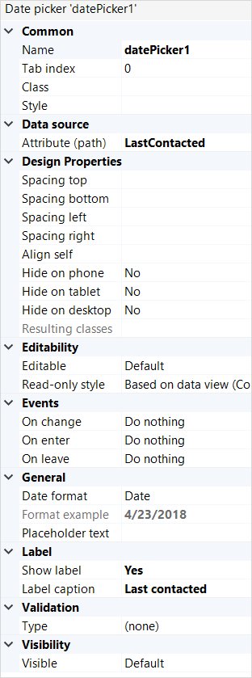

## 1 Introduction

A **date picker** is used to display and, optionally, allow the end-user to edit the value of an attribute of [data type](data-types) *Date and Time*. It uses the values set in the **Languages** tab of **App Settings** to display a correctly localized value to the end-user, using the **Language** object associated with the end-user.

A date picker must be placed in a [data widget](data-widgets) and displays an attribute of the object(s) retrieved by that widget. The name of the attribute to be displayed is shown inside the date picker, between square brackets, and colored blue.

For example, the following date picker allows the end-user to see, and set, the **LastContacted** date of a customer.

## 2 Properties

An example of date picker properties is represented in the image below:

{}
{}

Date picker properties consist of the following sections:

* [Common](#common)
* [Data source](#data-source)
* [Design Properties](#design-properties)
* [Editability](#editability)
* [Events](#events)
* [General](#general)
* [Label](#label)
* [Validation](#validation)
* [Visibility](#visibility)

### 2.1 Common Section{#common}

{}

### 2.2 Data Source Section{#data-source}

{}

### 2.3 Design Properties Section{#design-properties}

{} 

### 2.4 Editability Section{#editability}

{}

### 2.5 Events Section{#events}

#### 2.5.1 On Change{#on-change}

The on-change property specifies an action that will be executed when leaving the widget, either by using the <kbd>Tab</kbd> key or by clicking another widget, after the value has been changed.

{}

#### 2.5.2 On Enter

The on-enter property specifies an action that will be executed when the widget is entered, either by using the <kbd>Tab</kbd> key or by clicking it with the mouse.

{}

#### 2.5.3 On Leave

The on-leave property specifies an action that will be executed when leaving the widget, either by using the <kbd>Tab</kbd> key or by clicking another widget.

This differs from the [On change](#on-change) property in that the event will always be triggered, even if the value has not been changed.

{}

### 2.6 General Section{#general}

#### 2.6.1 Date Format

The date format determines whether the date picker displays the attribute values as a date, time, date and time, or in a custom format.

The format chosen here does not affect how data is stored; in all cases both a date and a time will be recorded. It merely affects how the data is displayed. The date and/or time formats also depend on the localization (language) of the end-user viewing the data.

The possible values for date format are shown below:

* **Date** *(default)*
* **Time**
* **Date and time**
* **Custom** (see below for more details)

#### 2.6.2 Custom Date Format

If you choose **Custom** as the date format (see above), this property determines how the attribute value is formatted. The custom date format is a string that allows for any combination of symbols found in the table below. Any punctuation will be rendered literally.

{}

{}
Even though a date picker with a custom date format is editable, the calendar drop-down button will only be shown if the custom format represents a full date (that is, the year [`y`-`yyyy`], month [`M`-`MMMM`], and day of month [`d`-`dd`] tokens are all present in the custom format).
{}

#### 2.6.3 Placeholder Text

The placeholder text is shown if the date attribute is empty. It can be used to give the end-user a hint as to the expected format.

{}
Placeholder text will not be displayed if a native date picker is available (that is, for iOS and Android versions 4.0 and above).
{}

### 2.7 Label Section{#label}

{}

### 2.8 Validation Section{#validation}

{}

### 2.9 Visibility Section{#visibility}

{}

## 3 Read More

*   [Data View](data-view)
*   [Attributes](attributes)
