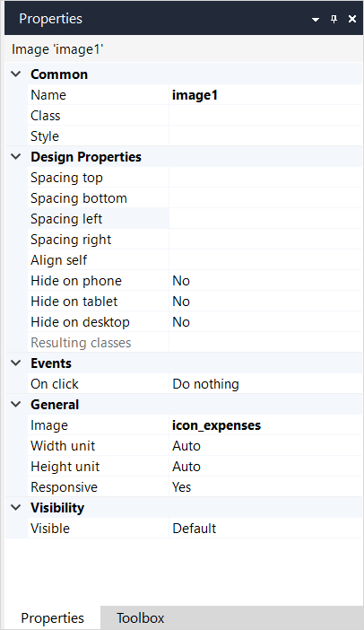

## 1 Introduction

The image widget can be used to show a static image on a page, layout, or snippet.

For example, you can configure an image clicking which a page with customer details opens:

{}

If you want to dynamically show different images based on data, you need to add [image viewer](image-viewer) on your page.

{}

## 2 Properties

An example of image properties is represented in the image below:

{}
{}

Image properties consist of the following sections:

* [Common](#common)
* [Design Properties](#design-properties)
* [Events](events)
* [General](#general)
* [Visibility](#visibility)

### 2.1 Common Section {#common}

{}

### 2.2 Design Properties Section {#design-properties}

{} 

### 2.3 Events Section {#events}

For information on the Events section and its properties, see [On Click Event & Events Section](on-click-event). 

### 2.4 General Section {#general}

#### 2.4.1 Image

The file name that this widget shows. For more information on when to use images and supported formats, see [Images](images).

#### 2.4.2 Width Unit

The width of an image. Possible values of this property are described in the table below:

| Value      | Definition                                                   |
| ---------- | ------------------------------------------------------------ |
| Auto  *(default)*       | The width of the given image is used.                        |
| Pixels     | he width is specified in a number of pixels. If you specify both width and height, the image will be scaled automatically: the proportions will be kept, the picture will not be stretched. |
| Percentage | The width is specified in a percentage of the original width. It can be larger than its original width in which case the image is stretched |

{}This property is not supported on native mobile pages.{}

#### 2.4.3 Width

Specifies the width of the image in pixels or percentage. This option is displayed only when **Pixels** or **Percentage** are selected for the **Width Unit** described above. 

Default: *not applicable*

#### 2.4.4 Height Unit

The height of an image. Possible values of this property are described in the table below: 

| Value      | Definition                                                   |
| ---------- | ------------------------------------------------------------ |
| Auto  *(default)*       | The height of the given image is used.                       |
| Pixels     | The height is specified in a number of pixels. If you specify both width and height, the image will be scaled automatically: the proportions will be kept, the picture will not be stretched. |
| Percentage | The height is specified in a percentage of the original height. It can be larger than its original height in which case the image is stretched. |

{}This property is not supported on native mobile pages.{}

#### 2.4.5 Height

Specifies the width of the image in pixels or percentage. This option is displayed only when **Pixels** or **Percentage** are selected for the **Width Unit** described above. 

Default: *not applicable*

#### 2.4.6 Responsive

This property influences how the image scales. If the value is 'Yes', the image will never get bigger than its original size. It can become smaller. If the value is 'No', the image can become both larger and smaller than its original size.

Default: *Yes*

{}This property is not supported on native mobile pages.{}

### 2.5 Visibility Section {#visibility}

{}

## 3 Converting to an Image Viewer

You can convert an image to an image viewer that allows you to display dynamic data. For more information on image viewer and its properties, see [Image Viewer](image-viewer). 

To convert an image widget into an image viewer, do the following:

1. Select the image widget on a page and right-click it.
2. From the list of actions, select **Convert to image viewer**. 

The image widget is converted to the image viewer and you can configure it. 

## 4 Read More

* [Page](page)
* [Common Widgets](common-widgets)
* [Properties Common in the Page Editor](common-widget-properties)

