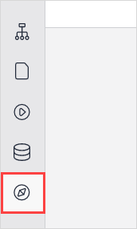
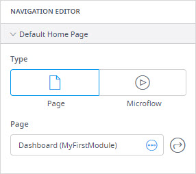
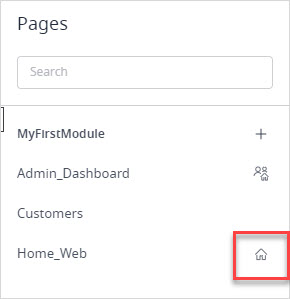
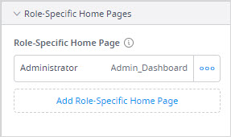
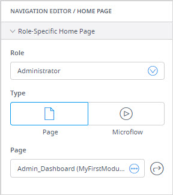
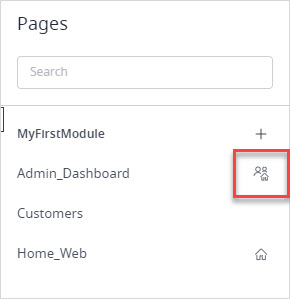
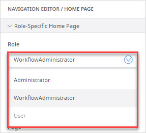
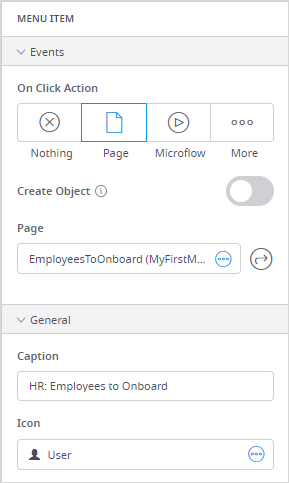

## 1 Introduction 

A **Navigation Document** in Mendix Studio shows a configured menu of your app in a form of a tree. You can create items and sub-items in your navigation. 

To open the **Navigation Document**, click the corresponding icon in the left menu bar.

The **Navigation Document** consists of menu items that allow end-users navigate your app or that perform certain actions. For example, you can configure a menu item to open a specific page or to log an end-user out of their profile. For more information on actions you can assign to menu items, see the [Events Section](#events-section-navigation).

You can also add a sub-item to a menu item. Mind that you cannot assign an action to the menu item that has the sub-item.  

{}

In Studio, you are viewing and editing a Responsive type of the navigation profile, while there are more types of profiles in Studio Pro. For more information on profiles in Studio Pro, see the [Profiles](/refguide/navigation#profiles) section in *Navigation* in the *Studio Pro Guide*. 

{}

## 2 Navigation Editor Properties

In navigation editor properties, you can set a [default home page](#default-home-page) and [role-specific home pages](#role-specific-home-page). 

### 2.1 Default Home Page {#default-home-page}

You can set a page or a microflow as a default home page:

The **Default Home Page** section consists of the following properties:

* **Page** – Allows you to set a page that is opened when an end-user opens the app. 
* **Microflow** – Allows you to set a microflow that is performed when an end-user opens the app. 

A home page icon is displayed in a list of pages or microflows against a page or microflow that is set as a home page:

### 2.2 Role-Specific Home Page {#role-specific-home-page}

A role-specific home page is a home page that that overrides the [default home page](#default-home-page) and is opened only for users with the specified role. You can set a separate home page per each role in your app. For more information on roles and how to create them, see [Security, Roles & Permissions](settings-security).

For example, an Administrator role can have the **Admin_Dashboard** page as its home page, while other users will have the default home page opened when they open the app:

When adding or editing the role-specific home page, you can set the following properties:

* **Role** – Defines what role has a dedicated home page.

* **Type** – Defines whether a page or a microflow is opened/performed when the user opens the app. The following types are available:

  * **Page** – A page is set as a home page.
  * **Microflow** – A microflow is set as a home page, i.e. a microflow is performed when a user opens the app.

* **Page** – This property is only available when the **Type** is set to **Page**. Allows you to set a dedicated home page that is opened for the selected role.

* **Microflow** – This property is only available when **Type** is set to **Microflow**. Allows you to set a microflow that is performed when a user with the selected role opens the app.

    

A role-specific home page icon is displayed in a list of pages or microflows against a page or microflow that is set as a home page:

### 2.3 Adding a Role-Specific Home Page

To add a role-specific home page, do the following:

1. Make sure your [security](settings-security) is enabled and configured.

2. Open the navigation editor > Navigation Editor properties.

3. In the **Role-Specific Home Page** section, click the **Add Role-Specific Home Page**.

4. In the **Role** drop-down menu, select a role that will have a dedicated home page:

    

5. Select the **Type** of the home page: a page or a microflow.

6. Depending on the selected type, choose either a page or a microflow that is be opened or performed when the user with the selected role opens the app.  

The role-specific home page is set.

## 3 Menu Item Properties {#properties-of-menu-items}

Properties of the menu items consists of the following sections:

* [Events](#events-section-navigation) 
* [General](#general-section-navigation) 

### 3.1 Events Section {#events-section-navigation}

You can choose the **On Click Action** in the **Events** section. The **On Click Action** defines what action is performed when the user clicks a menu item. 

{}
If a menu item has a sub-item(s), it cannot have an action configured for it.
{}

The available actions are described in the table below:

| Action         | Description                                                  |
| -------------- | ------------------------------------------------------------ |
| Nothing        | No action is taken.                                          |
| Page           | The specified page is opened.                                |
| Microflow      | The selected microflow is executed.                          |
| Save Changes   | Saves (commits) all changes made in the currently opened page and closes the page. |
| Cancel Changes | Rolls back all changes made in the currently opened page and closes the page. |
| Close Page     | Closes the pop-up window (for pop-up pages) or navigates to the previously visited page. Note that this action will close the page and the changes if any will not be saved. Use **Save Changes** for this purpose. |
| Sign Out       | The current user is signed out of the app.                   |
| Open Link      | Triggers an action based on the link type: <ul><li>**Web** – navigates to a website </li><li>**Email** – composes an email</li><li>**Phone Call** – starts a phone call</li><li>**Text Message** - sends a text message</li></ul>**Note** When you configure **Email**, **Phone Call** or **Message** options, the corresponding default app will be opened on the device when the action is triggered, for example, the default email client will be opened to compose a message. |

{}

If a menu item has a sub-item, the **On Click Action** should be **Nothing**. 

{}

### 3.2 General {#general-section-navigation}

The properties that can be configured in the **General** section are the following:

* **Caption** – Allows you to fill in the name of the menu item.
* **Icon** – Allows you to set the icon of the menu item.

### 3.3 Creating a Menu Item {#create-new-menu-items}

To create a new menu item, do the following:

1. Click the **Navigation Document** icon in the left menu bar to open the **Navigation**.

2. Click a plus at the bottom of the navigation tree to create a menu item, or click a plus next to the existing navigation item to create its sub-item

    

3. Specify the properties of the created item if needed (For more information, see [Properties of Menu Items](#properties-of-menu-items)). 

A new menu item or a sub-item is added to the navigation.

## 4 Read More

* [General Info](general)
* [Navigation Consistency Errors](consistency-errors-navigation)
